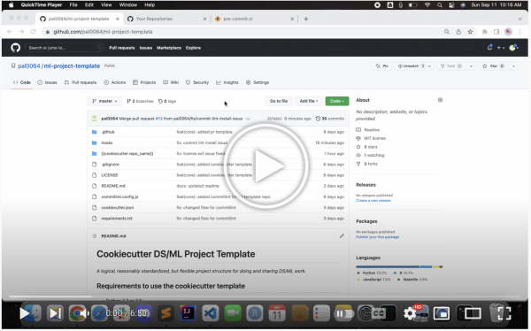

# Sonic

_Sonic is a framework that creates a standard DS/ML project structure having many popular automation features. Anyone who wants to work on DS/ML project can use Sonic. You can use Sonic in your projects, interview assignments, course homeworks etc._

## Demo

[](https://www.youtube.com/watch?v=ILQb66cjV4g)


## Why should you use Sonic?

- Saves Time: 
    Starting a project is always time consuming, thinking about structuring your code, adding basic integrations. All of these steps take time, Sonic saves your precious time by automating these simple steps.

- Better chances in getting job:
    Programming assignments from good companies(FAANG) or academic institutions check the project strucure, code practices along with the fucntionality of the code. Sonic takes care of these small things for you so that you can foucs on the functionality of the code. Sonic's integrations in your project, makes your project unique from all other submissions. So eventually better chances in getting job.

## The resulting directory structure

The directory structure of your new project looks like this: 

```
├── LICENSE
├── Makefile           <- Makefile with commands like `make data` or `make train`
├── README.md          <- The top-level README for developers using this project.
├── datasets
│   ├── external       <- Data from third party sources.
│   ├── interim        <- Intermediate data that has been transformed.
│   ├── final          <- The final, canonical data sets for modeling.
│   └── raw            <- The original, immutable data dump.
│
├── notebooks          <- Jupyter notebooks. Naming convention is a number (for ordering),
│                         the creator's initials, and a short `-` delimited description, e.g.
│                         `1.0-jqp-initial-data-exploration`.
├── references         <- Data dictionaries, manuals, and all other explanatory materials.
│
├── docs               <- Code documentation and generated analysis as HTML, PDF, LaTeX, etc.
│   └── images         <- Generated graphics and figures to be used in reporting
|   └── reports        <- Generated analysis as HTML, PDF, LaTeX, etc.
│
├── requirements.txt   <- The requirements file for reproducing the analysis environment, e.g.
│                         generated with `pip freeze > requirements.txt`
│
├── src                <- Source code for use in this project.
|__ output             <- Temporary Output files
```

## Extra Features
- Commit Message checking via commitlint
- [Linter support for R lang](https://github.com/r-lib/lintr)
- [R Lang Code formatter using Styler](https://github.com/r-lib/styler)
- [R lang general checks using pre-commit hooks](https://lorenzwalthert.github.io/precommit/articles/available-hooks.html)
- [Local Testing via pre-commit](https://pre-commit.com/)
- Github Integration 
- CI testing via Github actions and pre-commit.ci
- Github CODEOWNERS to automatically add owners to Github PR
- Github pull request remplates for standardizing description
- Multiple programming language support in the directory structure
- R Lang test cases (testthat) support using Makefile and Github actions

## Requirements to use the Sonic

 - [Python 2.7 or 3.5+](https://www.python.org/downloads/)
 - [Cookiecutter](http://cookiecutter.readthedocs.org/en/latest/installation.html): It helps in creating a project structure. This can be installed with pip by or conda depending on how you manage your Python packages:

``` bash
pip install cookiecutter
```

or

``` bash
conda config --add channels conda-forge
conda install cookiecutter
```
or 

``` bash
brew install cookiecutter
```

## Installing development requirements

    pip install -r requirements.txt

##  Other installations
- [R language](https://www.r-project.org)
- [pre-commit](https://pre-commit.com/) : Precommit runs your hooks(tests) for identifying issues before submission to code review and even before commit.

    ```
        pip install pre-commit
    ```
- [commitlint](https://github.com/conventional-changelog/commitlint) : It’s a simple tool that lints your commit messages and makes sure that they follow a set of rules. 
    ```
        npm install -g @commitlint/cli @commitlint/config-conventional
    ```
    for this Nodejs is required. Download and install from here [Nodejs](https://nodejs.org/en/download/)

## To start a new project, run:

    cookiecutter gh:pal0064/sonic

If this doesn't work try using SSH with the full path:

```
cookiecutter git+ssh://git@github.com/pal0064/sonic
```

## Future Work
- Automated Documentation
- Platform independence
- Multiple language support 
- Test coverage Report
- Lesser Todos for the user


## Acknowledgements
- [drivendata/cookiecutter-data-science](https://github.com/drivendata/cookiecutter-data-science)

    Sonic's extra features: 
    - Github integration
        - PR Templates
        - Codeowners for automatically adding reviewer
    - R Language support
    - Local/Remote Testing via pre-commit/pre-commit.ci
    - Github Actions suppport
    - Commit Message checking via commitlint
    - Simplifying commands execution using Makefile


## Note:
This template is tested with Mac OS. So, all the commands and programs should work smoothly on mac and linux. Windows user might face some issues in the installation. Our future goal is to make this template platform independent.

License
-------

This project is licensed under the terms of the [MIT License](/LICENSE)
